# Водоспади та фонтани

#### Опис


Сьогодні ми продовжимо подорож Стародавнім світом, але перемістимося в інше місто, ще більш давнє —  Вавилон, і побудуємо водоспади і фонтани⛲️


## Згадаймо🤔

1. Хто такий Мінотавр?
2. Як можна зробити «Мінотавра» в Minecraft?
3. Як створити систему запуску фейєрверків?
4. Як створити систему з липкого поршню?

## Сьогодні ми:

1. Побудуємо різні фонтани
2. Зробимо башту з водою
3. У башті зробимо ванни для води
4. Зробимо «живі» фонтани та час


Перші фонтани виникли ще в глибоку давнину і спочатку мали лише **практичне призначення**: стародавні єгиптяни споруджували їх для поливу рослин і розміщували у фруктових садах. Фонтани на знаменитих висячих садах Семіраміди -це одне з незбережених див світу, що розміщались у Вавилоні, у VII ст. до нашої ери.&#x20;

Сьогодні ми з вами навчимося створювати фонтани, щоб потім помістити їх у Вавилонські сади⛲️


## **Зробимо заготовку**

| <ol><li>Зробимо основу</li></ol>            | 
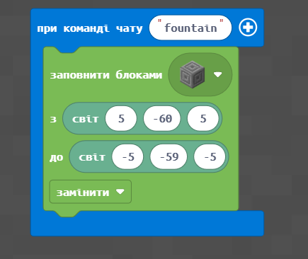 
      |
| ------------------------------------------- | ---------------------------------------------------------------------------------------------------------- |
| 2. В середині зробимо заглибення (для води) | 
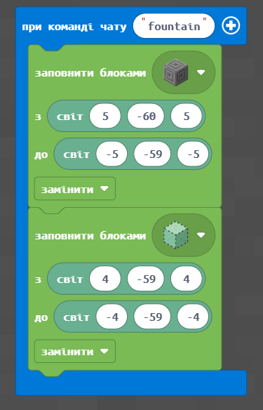 
      |
| 3. **** Створимо джерело води               | 
 
 |

## Основне завдання

| **№**         | 1                                                                                                                                                                                                                                                                                                                                                                                                                                                                                                                                                                                                                                                                                                                                                                                                                                                              |
| ------------- | -------------------------------------------------------------------------------------------------------------------------------------------------------------------------------------------------------------------------------------------------------------------------------------------------------------------------------------------------------------------------------------------------------------------------------------------------------------------------------------------------------------------------------------------------------------------------------------------------------------------------------------------------------------------------------------------------------------------------------------------------------------------------------------------------------------------------------------------------------------- |
| **Завдання**  | 

<ol><li><strong>Створіть фонтан</strong>. Базова частина від <strong>(5;-60;5)</strong> до <strong>(-5;-59;-5)</strong> із заглибленням в один блок від <strong>(4;-60;4)</strong> до <strong>(-4;-60;-4)</strong> з наповненням води з точки <strong>(0;-56;0).</strong></li><li>Створіть <strong>широкий</strong> фонтан. Базова частина від <strong>(7;-60;7)</strong> до <strong>(-7;-58;-7)</strong> із заглибленням в два блоки від <strong>(6;-59;6)</strong> до <strong>(-6;-60;-6)</strong> з наповненням води з точки <strong>(0;-55;0)</strong>.</li><li>Створіть <strong>вузький</strong> фонтан. Базова частина від <strong>(3;-60;3)</strong> до <strong>(-3;-57;-3)</strong> із заглибленням в три блоки від <strong>(2;-58;2)</strong> до <strong>(-2;-60;-2)</strong> з наповненням води з точки <strong>(0;-54;0)</strong>.</li></ol> |
| **Код**       | 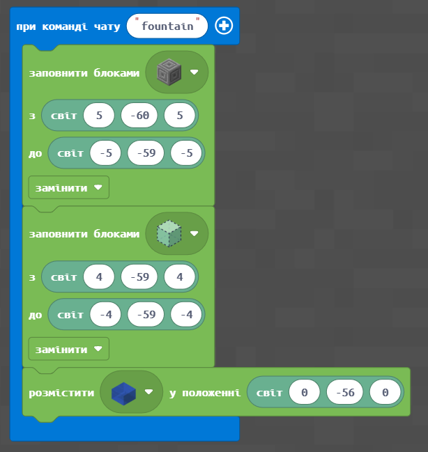                                                                                                                                                                                                                                                                                                                                                                                                                                                                                                                                                                                                                                                                                                                                                                                                                                   |
| **Результат** | .png>)                                                                                                                                                                                                                                                                                                                                                                                                                                                                                                                                                                                                                                                                                                                                                                                                                          |

## Творче завдання

1. Створіть фонтан **не квадартної** форми.
2. Створіть фонтан **круглої** форми.

## Супер-творче завдання

Зробіть фонтани (обведено синім) та зелені насадження (обведено зеленим), як на привокзальній площі Харкова.

.png>)

## Круглий фонтан з підсвіткою

|            |                                                                                           |
| ---------- | ----------------------------------------------------------------------------------------- |
|            |                                                                                           |
| Завдання:  | Побудувати круглий фонтан з підсвіткою з радіусом 8 та зі сферою води в точці (0; -54; 0) |
| Код:       | 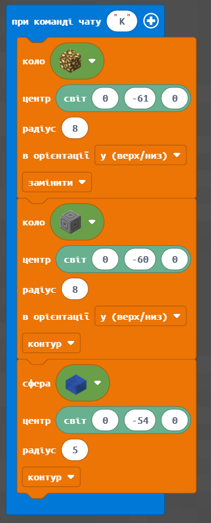                                                              |
| Результат: | 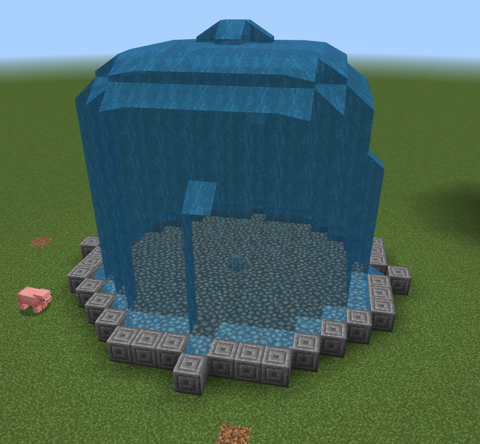                                                              |


Фігури і особливо Сфери будуються довго. Тому, потрібно чекати поки не з’явиться вода, щоб координати не збилися у побудові.


## Башта із водою

| **№**         | **2**                                                                                                                                                                                                                                                                                                                                                                                                                                                                                                    |
| ------------- | -------------------------------------------------------------------------------------------------------------------------------------------------------------------------------------------------------------------------------------------------------------------------------------------------------------------------------------------------------------------------------------------------------------------------------------------------------------------------------------------------------- |
| **Завдання**  | 

<ol><li>Побудуйте башту від точки <strong>(3;-60;3)</strong> до точки <strong>(-3;-52;-3)</strong>: башта <strong>7х7</strong> із висотою <strong>11 блоків</strong>. </li><li>Із прорізями для майбутнього фонтану: від <strong>(3;-52;0)</strong> до (<strong>-3;-52;0)</strong> та від <strong>(0;-52;3)</strong> до <strong>(0;-52;-3)</strong></li><li>Побудуйте башту <strong>10х10</strong> висотою <strong>5 блоків</strong> із прорізами, що йдуть навхрест через центр башти.</li></ol> |
| **Код**       | 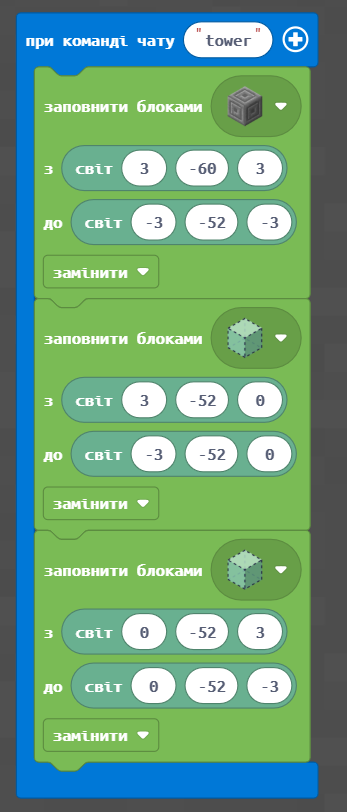                                                                                                                                                                                                                                                                                                                                                                                                                                                                             |
| **Результат** | .png>)                                                                                                                                                                                                                                                                                                                                                                                                                                                                     |

## Творчі завдання:

1\. Залийте прорізи водою (візьміть в інвентарі відро з водою чи додайте блок із водою).

.png>)

2\. Додайте більше прорізів (так, щоб вони проходили через один блок).

## Ванни для води

| **№**         | **3**                                                 |                                       |
| ------------- | ----------------------------------------------------- | ------------------------------------- |
| **Завдання**  | <ol><li>Додайте блоки ванни для збору води.</li></ol> | 2. Пустіть водоспад                   |
| **Код**       | 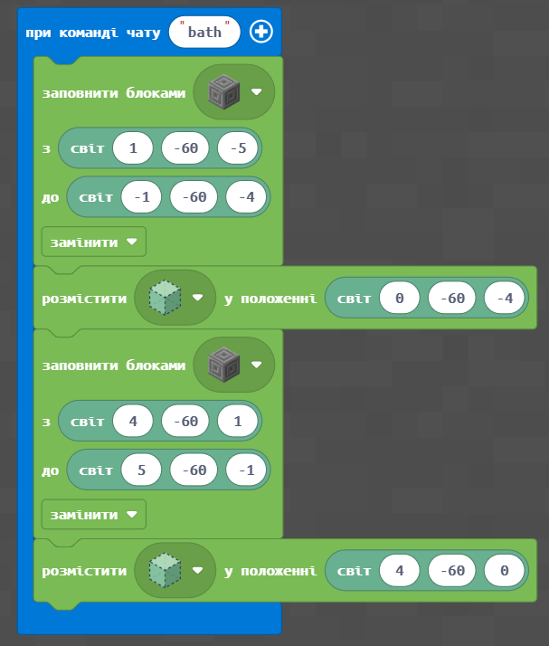                          | 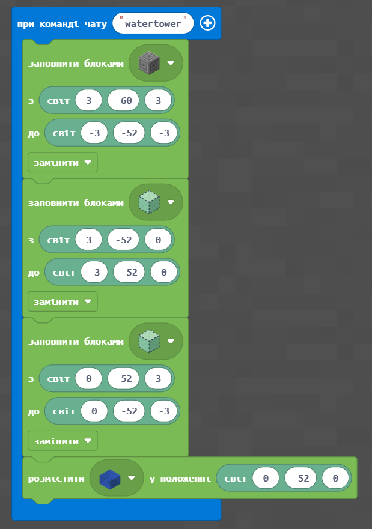          |
| **Результат** | .png>)                 | .png>) |

## Робота із часом

У Minecraft є час. Найпростіша можливість ознайомитись із часом — це вивести на екран поточне значення ігрового часу:

.png>).png>)

## «Живі» фонтани та час

| **№**         | **4**                                                                                                                                                                                                                                                                                                                                                                                                                                                                                                |
| ------------- | ---------------------------------------------------------------------------------------------------------------------------------------------------------------------------------------------------------------------------------------------------------------------------------------------------------------------------------------------------------------------------------------------------------------------------------------------------------------------------------------------------- |
| **Завдання**  | <ol><li>Запрограмуйте <strong>появу води</strong> та <strong>зникнен</strong>ня її (заповнення місць появи води повітрям) з інтервалом <strong>3</strong> секунди.</li><li>Запрограмуйте появу води та зникнення її (заповнення місць появи води повітрям) з інтервалом <strong>5</strong> секунд.</li><li>Запрограмуйте появу води та зникнення її (заповнення місць появи води повітрям) так, щоб вода <strong>з'являлася на 5 секунд</strong>, а <strong>зникала на 3 секунди.</strong></li></ol> |
| **Код**       | 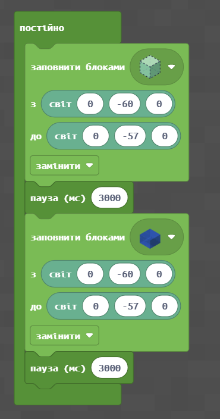                                                                                                                                                                                                                                                                                                                                                                                                                                                                         |
| **Результат** |                                                                                                                                                                                                                                                                                                                                                                                                                                                           |

## Творче завдання

Реалізуйте **запрограмовані фонтани** (поява/зникнення води) на площі, яку ви програмували в першому творчому завданні

## Додаткове (ускладнене) завдання

| 
Реалізуйте появу та зникнення води, спираючись на ігровий час.  

<strong>Крок 1.</strong> Вивід тексту на екран.
 | 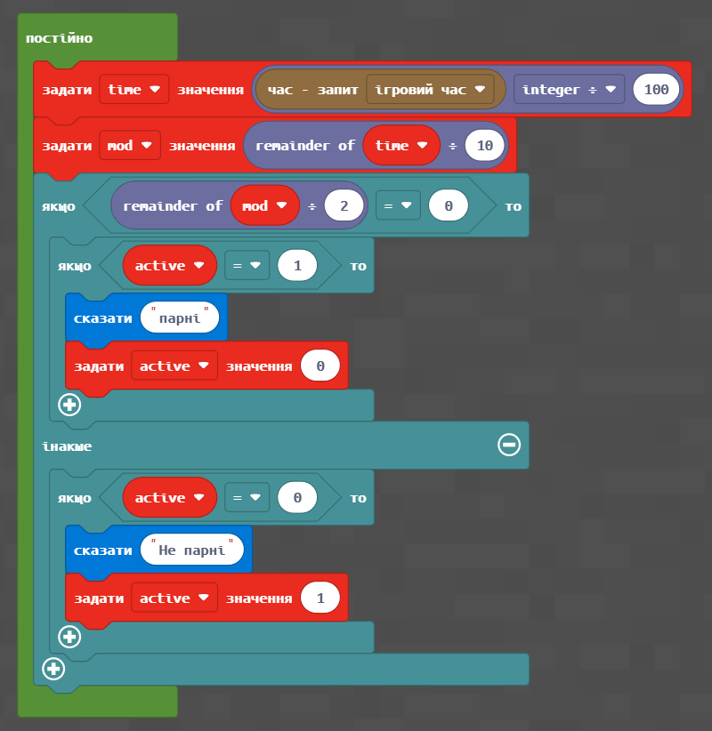                                                                    |
| -------------------------------------------------------------------------------------------------------------------------------- | ----------------------------------------------------------------------------------------------- |
| **Крок 2.** Поява та зникнення води                                                                                              | 
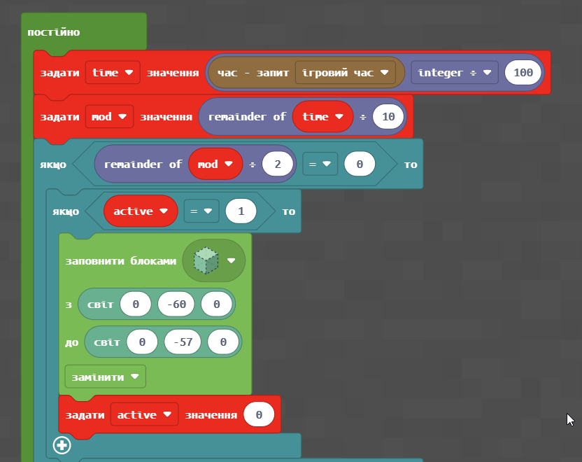 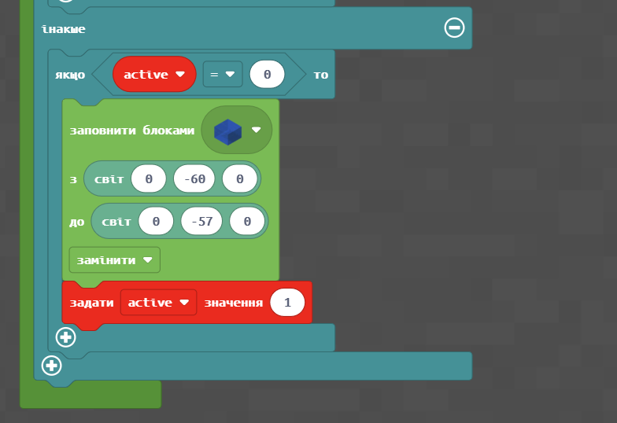
 |

## Домашнє завдання:

Завдання 1. Зробити код своєї версії фонтану

Завдання 2. (додаткове) Розмістити у фонтані рибу

Завдання 3. (додаткове) Розмістити дороги між фонтанами та висадити квіти

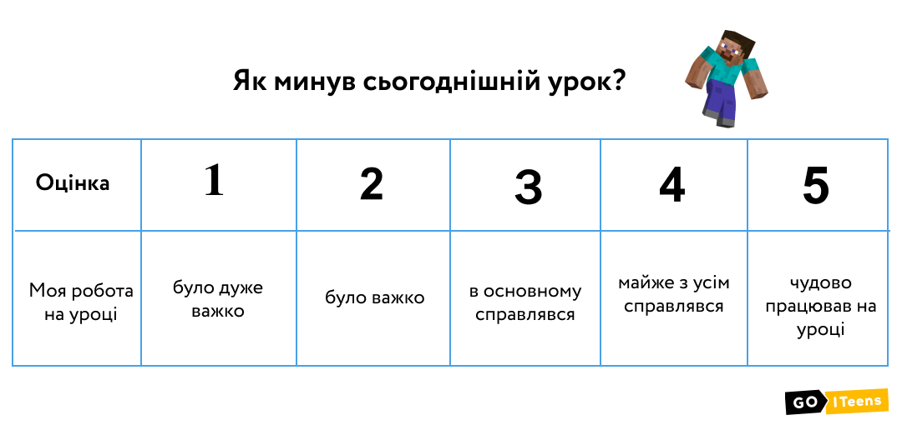

На наступному занятті ми продовжимо подорож Вавилоном, і ви отримаєте навички, які знадобляться під час виконання вашого проєкту😉
